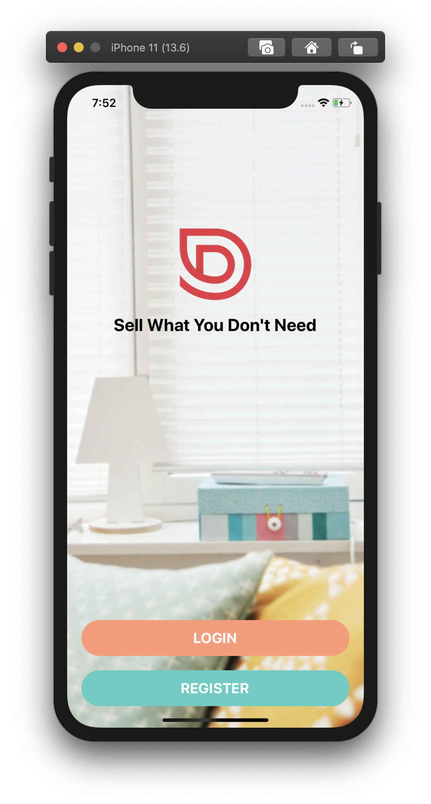
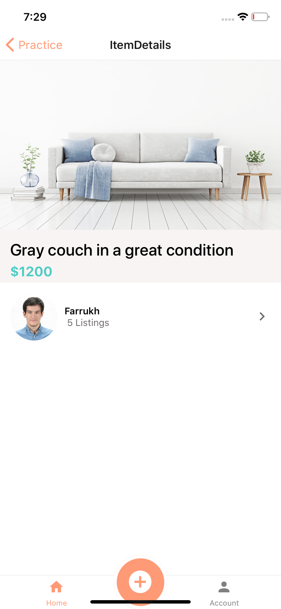
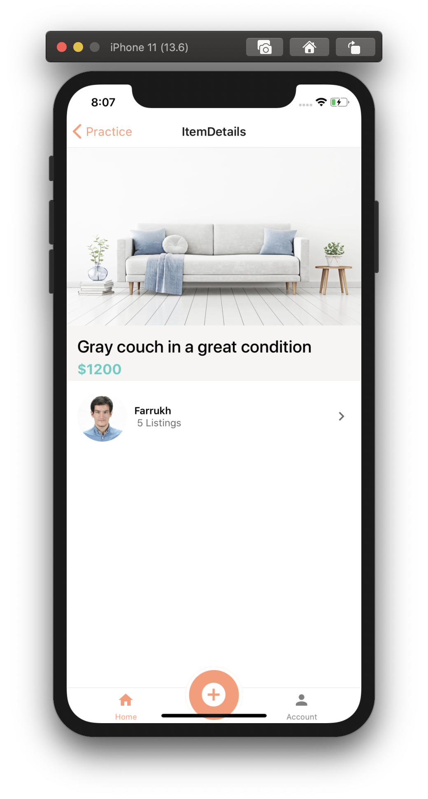
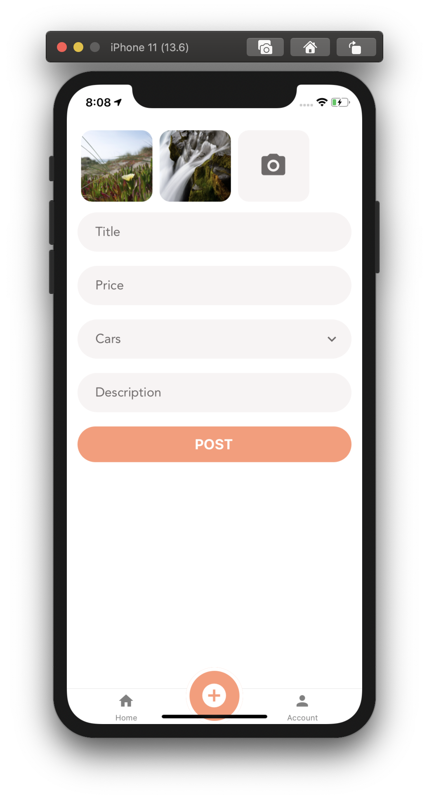
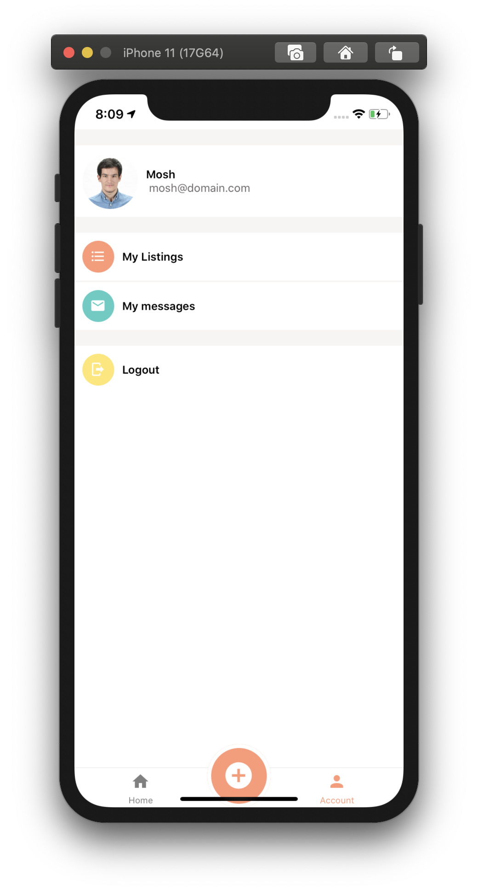
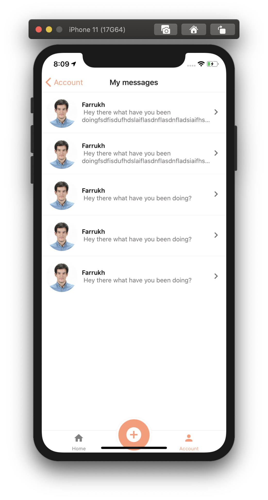
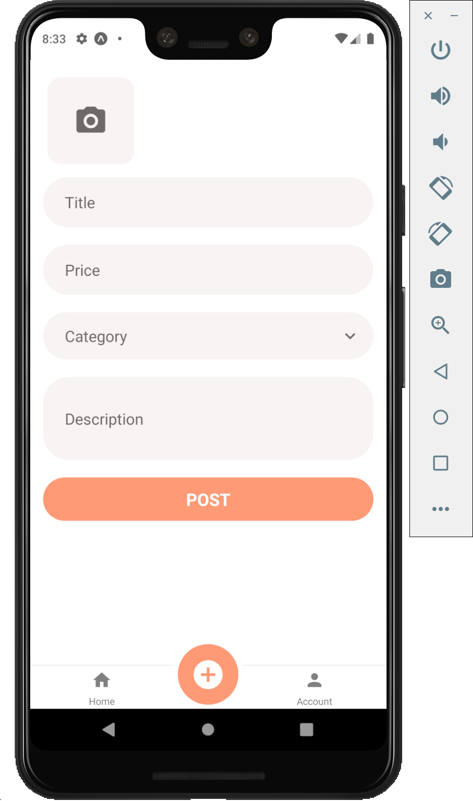
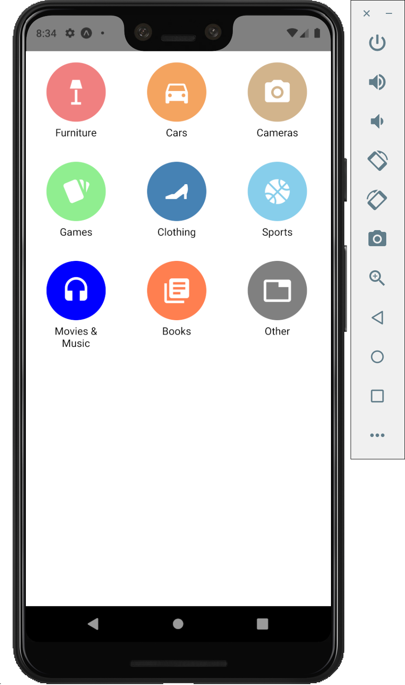

# DoneWithIt - The cross platform app to sell second hand items

## 👀 Preview
| | | |
|:-------------------------:|:-------------------------:|:-------------------------:|
| | | |
| | | |
| | | |


## 🚀 Quick start
1.  **Start developing.**

    Navigate into your new site’s directory and start it up. Make sure Expo is installed in your environment

    ```shell
    git clone https://github.com/augini/react-native-app-DoneWithIt.git
    cd react-native-app-DoneWithIt.git/
    npm install
    npm start (expo start)
    ```


2.  **Open the source code and start editing!**

    Your site is now running at `http://localhost:8000`!

    _Note: You'll also see a second link: _`http://localhost:8000/___graphql`_. This is a tool you can use to experiment with querying your data. Learn more about using this tool in the [Gatsby tutorial](https://www.gatsbyjs.org/tutorial/part-five/#introducing-graphiql)._


## 💫 Deploy

